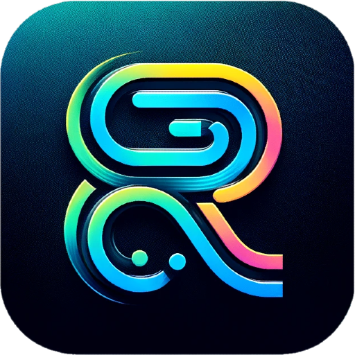

# remix-electron-llamafile



This is a template for creating a Remix + Llamafile + Electron app.

## Setup

```shellscript
npx create-remix@latest --template jacob-ebey/remix-electron-llamafile
```

## Development

Install dependencies and rebuild the native modules for Electron:

```shellscript
npm install && npm run rebuild
```

You can develop your app just like you would a normal Remix app, via:

```shellscript
npm run dev
```

## Production

When you are ready to build a production version of your app:

```shellscript
npm run build
```

will generate your production assets.

```shellscript
npm run package
```

will package your app into a distributable format.

```shellscript
npm run make
```

will create an installer for your app.
